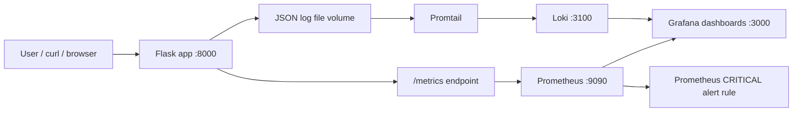
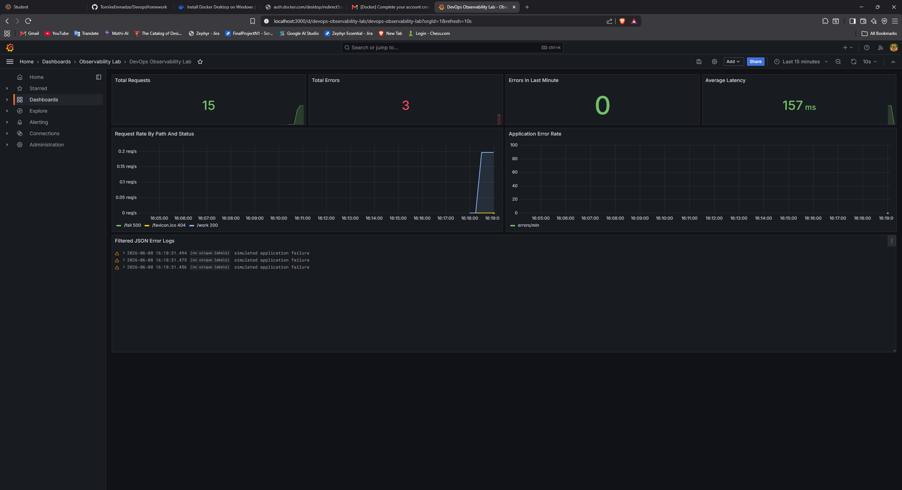
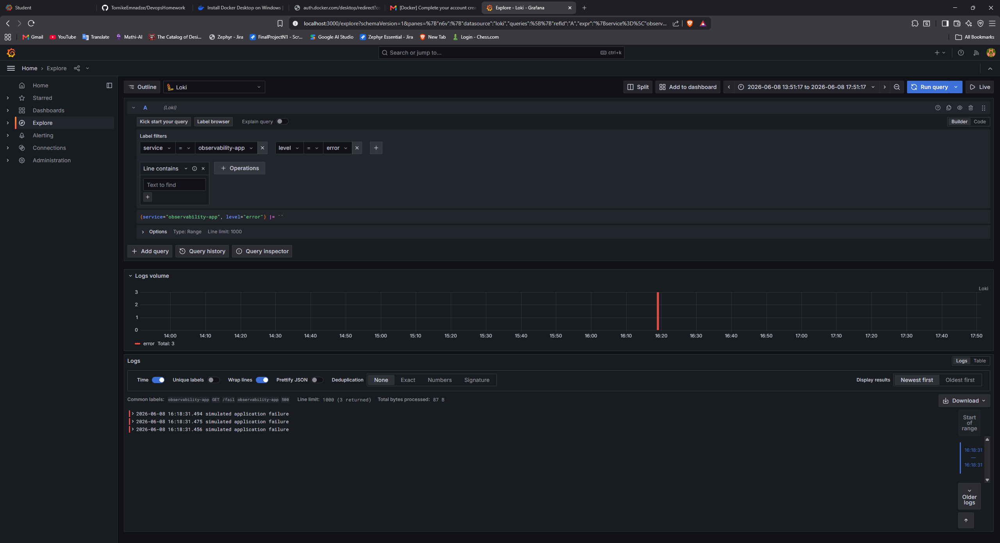
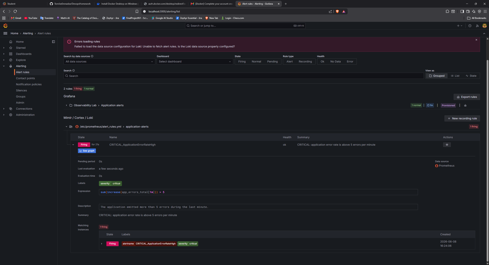
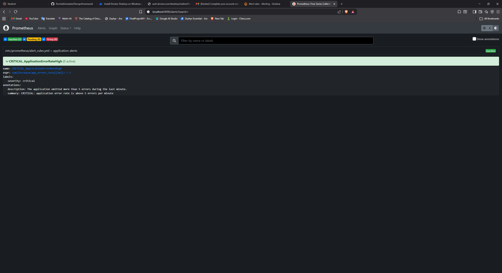

# DevOps Observability Lab

This repository contains a complete Docker Compose observability stack for a small instrumented Flask application.

## Architecture Diagram



## Services

| Service | Purpose | URL |
| --- | --- | --- |
| app | Flask application with JSON logs and Prometheus metrics | http://localhost:8000 |
| Prometheus | Scrapes app metrics and evaluates the CRITICAL alert rule | http://localhost:9090 |
| Grafana | Dashboards, Loki log analysis, and provisioned alert view | http://localhost:3000 |
| Loki | Log storage and query backend | http://localhost:3100 |
| Promtail | Reads the app JSON log file and ships entries to Loki | internal |

Default Grafana login:

```text
username: admin
password: admin
```

## Run The Stack

Start everything with one command:

```powershell
docker compose up --build
```

Open the application:

```powershell
curl.exe http://localhost:8000/
curl.exe http://localhost:8000/work
curl.exe http://localhost:8000/metrics
```

Grafana is automatically provisioned with:

- Prometheus datasource
- Loki datasource
- `DevOps Observability Lab` dashboard
- `CRITICAL - Application error rate > 5/min` Grafana alert rule

Prometheus also loads the required rule from `prometheus/alert_rules.yml`:

```promql
sum(increase(app_errors_total[1m])) > 5
```

## Instrumentation Details

The application exposes custom counters through `/metrics`:

- `app_requests_total`
- `app_errors_total`

It also exposes a latency histogram:

- `app_request_duration_seconds`

Every non-metrics request emits JSON logs to stdout and to `/var/log/app/app.log`. The file is stored in a Docker volume shared with Promtail. Promtail parses JSON fields, promotes useful fields to Loki labels, and ships the logs to Loki.

Example log shape:

```json
{"timestamp":"2026-06-08T11:00:00.000000Z","level":"info","message":"request completed","trace_id":"...","method":"GET","path":"/work","status":200,"duration_ms":83.4,"remote_addr":"172.18.0.1"}
```

## Simulate The CRITICAL Alert

The alert fires when the app records more than 5 errors in one minute.

Run this command after the stack is up:

```powershell
1..6 | ForEach-Object { curl.exe -s -o NUL -w "%{http_code}`n" http://localhost:8000/fail }
```

Then wait about 60 seconds for Prometheus and Grafana alert evaluation.

Check the alert in Prometheus:

- Open http://localhost:9090/alerts
- Look for `CRITICAL_ApplicationErrorRateHigh`

Check the alert in Grafana:

- Open http://localhost:3000
- Go to `Alerting` -> `Alert rules`
- Open the `Observability Lab` folder
- Look for `CRITICAL - Application error rate > 5/min`

## Log Analysis

In Grafana, go to `Explore`, choose the Loki datasource, and run:

```logql
{service="observability-app"} | json
```

To show only failed requests:

```logql
{service="observability-app"} | json | level="error"
```

The provisioned dashboard also includes a `Filtered JSON Error Logs` panel using the error filter.

## Evidence Screenshots

The screenshots below were captured from the running Docker Compose observability stack.

### Grafana dashboard displaying custom application metrics



### Grafana Loki log analysis showing filtered JSON error logs



### Grafana Alerting tab showing the active CRITICAL alert rule



### Prometheus alert rule evidence



## Analysis

### Why is JSON-structured logging more efficient than plain text logs?

JSON logs are machine-readable. Each log entry already has fields such as `level`, `path`, `status`, and `trace_id`, so tools like Promtail, Loki, Elasticsearch, and Grafana can parse, filter, label, and aggregate logs without guessing with fragile regular expressions. This makes searching faster, reduces parsing mistakes, and makes logs easier to correlate with metrics and traces.

### What is the fundamental technical difference between Prometheus and Loki?

Prometheus stores numeric time-series metrics. It scrapes `/metrics` endpoints on a schedule, stores samples with labels, and is optimized for mathematical queries such as rates, percentiles, thresholds, and alert rules.

Loki stores log streams. It indexes labels and keeps the full log content as entries over time. It is optimized for searching and filtering event records, especially when investigating what happened around a metric spike or alert.

### How would you handle long-term log retention for 6 months without depleting disk resources?

For long-term retention, I would avoid keeping all logs on local Docker volumes. I would configure Loki retention policies, reduce noisy/debug logs, and ship older chunks to cheaper object storage such as S3, Azure Blob Storage, or Google Cloud Storage. I would also separate retention by value: critical application errors and audit logs can be kept longer, while high-volume info/debug logs can be sampled, compressed, or deleted sooner.

## Useful Commands

Stop the stack:

```powershell
docker compose down
```

Stop the stack and delete stored volumes:

```powershell
docker compose down -v
```

View app logs:

```powershell
docker compose logs app
```

Validate Prometheus targets:

- http://localhost:9090/targets
